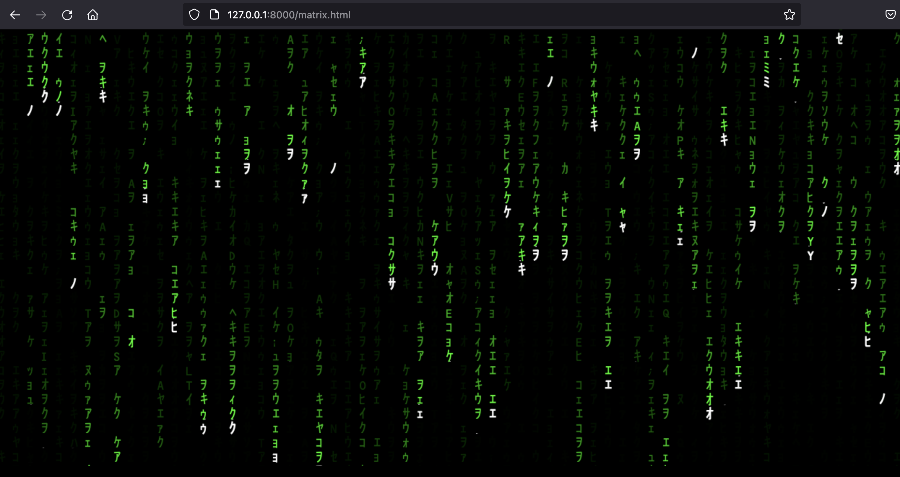
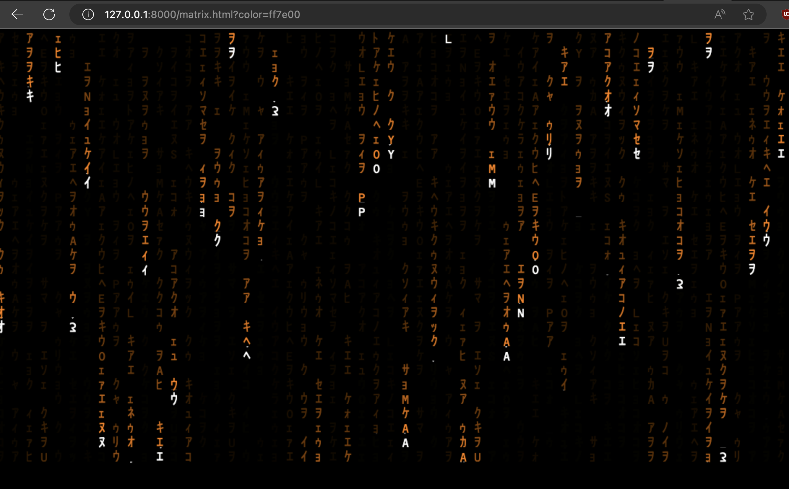

# Javascript Matrix.html

### SP

El efecto Matrix en la página "Jaime Cortés" es una impresionante representación visual inspirada en la popular trilogía cinematográfica "The Matrix". Al cargar la página, los visitantes son recibidos por una animación en canvas que evoca el icónico código verde cayendo en cascada de la película.

El efecto se logra mediante la generación de una matriz de caracteres que representan el poema seleccionado aleatoriamente desde una colección de documentos. Cada carácter se coloca en una posición específica de la columna y va descendiendo gradualmente, creando la ilusión de un flujo continuo y vertical similar al código fuente visto en las películas.

Los caracteres de la matriz están dispuestos en una fuente especial de estilo "matrix" que recuerda la estética digital y futurista de la película. Además, se ha realizado una sustitución creativa de algunos caracteres especiales para agregar un toque único y personalizado a la presentación.

La animación del efecto Matrix es suave y cautivadora, con caracteres que aparecen y desaparecen gradualmente a medida que avanzan por la columna. Los caracteres blancos se borran y se sustituyen por un rectángulo negro semitransparente, lo que crea un efecto de movimiento fluido y enigmático.

El usuario también tiene la opción de personalizar el color de los caracteres en la animación mediante la modificación de un parámetro en la URL, lo que permite adaptar la experiencia visual a sus preferencias personales.

Se da soporte, durante su ejecución, de las siguientes opciones

        +        para aumentar la velocidad
        -        para disminuir la velocidad
        r,g,b,a  para cambiar color r:Rojo, g:Verde, b:Azul, a:Ambar
       

### EN

The Matrix effect on the "Jaime Cortés" page is an impressive visual representation inspired by the popular film trilogy "The Matrix." Upon loading the page, visitors are greeted with a canvas animation that evokes the iconic green code cascading down from the movie.

The effect is achieved by generating a matrix of characters representing the randomly selected poem from a collection of documents. Each character is placed in a specific position in the column and gradually descends, creating the illusion of a continuous and vertical flow similar to the source code seen in the movies.

The characters in the matrix are arranged in a special "matrix" style font that recalls the digital and futuristic aesthetics of the film. Additionally, there has been a creative substitution of some special characters to add a unique and personalized touch to the presentation.

The animation of the Matrix effect is smooth and captivating, with characters gradually appearing and disappearing as they move down the column. The white characters are erased and replaced by a semitransparent black rectangle, creating a fluid and enigmatic motion effect.

The user also has the option to customize the color of the characters in the animation by modifying a parameter in the URL, allowing them to tailor the visual experience to their personal preferences.
